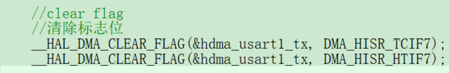
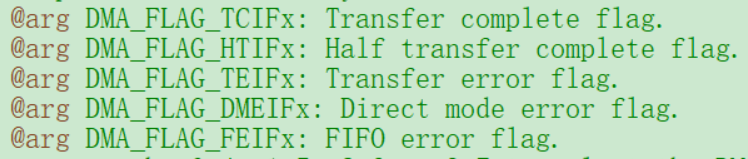

## V1.0.0
----

- 一个DMA通道不能完成同时收发，但可以实现不同时收发。
- 使能DMA必须要使能串口中断

#### 发送
- usart1_tx_dma_enable()中的清除标志位要根据DMA通道改变

#### 接收
- dma_rx在普通模式下，接收完一次数据后，CNDTR自动清0，需要先关闭DMA，重置CNDTR，然后再开启DMA。接收完一次数据后，CNDTR不清0，可继续接收下一次的数据。
- USART1_IRQHandler()中不能删除HAL_UART_IRQHandler()。否则HAL_UART_Transmit_DMA()在循环里只能发送一次。
- DMA双缓冲区模式：当DMA内存区域填满时才会指向另一个内存区域。所以需要手动更改内存区域。